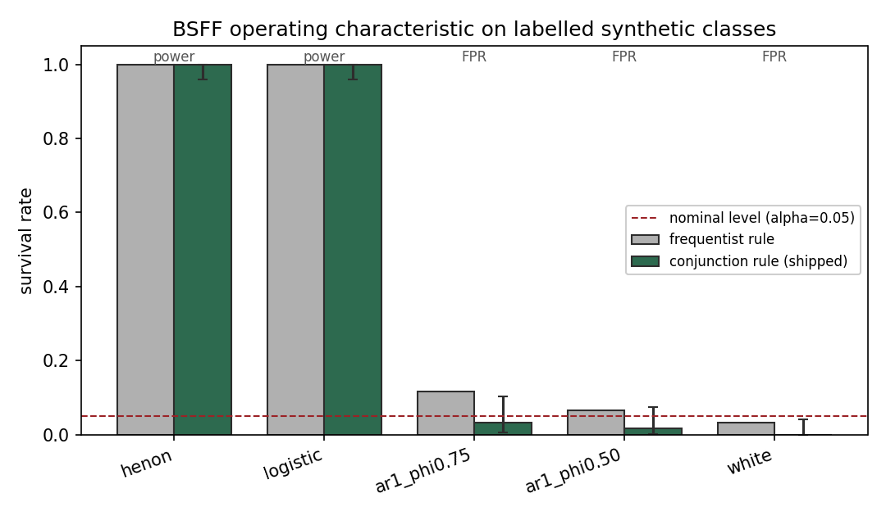

<!-- SPDX-License-Identifier: CC-BY-4.0 -->

<div align="center">

```text
██████╗ ███████╗███████╗███████╗
██╔══██╗██╔════╝██╔════╝██╔════╝
██████╔╝███████╗█████╗  █████╗  
██╔══██╗╚════██║██╔══╝  ██╔══╝  
██████╔╝███████║██║     ██║     
╚═════╝ ╚══════╝╚═╝     ╚═╝     
```

# BSFF — BCI Signal Falsification Framework

**Independent, machine-checked falsification of BCI signal claims.**

[](https://github.com/neuron7xLab/bsff/actions/workflows/ci.yml)
[](https://github.com/neuron7xLab/bsff/actions/workflows/security.yml)
[](https://github.com/neuron7xLab/bsff/actions/workflows/provenance.yml)
[](STATUS.md)
[](pyproject.toml)
[](LICENSE)
[](NOTICE)
[](tools/validate_ip_provenance.py)

**BSFF does not trust. It tests.**

</div>

---

> **BSFF is the falsification gate for neural-decoding claims** — a deterministic,
> fail-closed CI step that sits between a signal *result* and the *claim* it
> licenses, and returns a **provenance-bound verdict instead of trust**.
> A result is not a claim; BSFF is where the gap is machine-checked.
> ([`POSITIONING.md`](POSITIONING.md) fixes the coordinate · [`NAVIGATION.md`](NAVIGATION.md) is the map.)

## See it kill a claim — 60 seconds, no data download

Point BSFF at *someone's* claim about a signal; it tries to refute it under a
stated attack battery and returns a bounded, hash-stamped verdict.

```bash
git clone https://github.com/neuron7xLab/bsff && cd bsff && pip install -e ".[stats]"

# A genuinely nonlinear signal survives the surrogate attack:
bsff falsify --claim examples/falsify/claim.json --signal examples/falsify/signal_chaotic.csv --policy strict
#  → verdict: SURVIVED   (p ≈ 0.001)

# The same claim on a linear-stochastic null is refuted:
bsff falsify --claim examples/falsify/claim.json --signal examples/falsify/signal_null.csv  --policy strict
#  → verdict: REFUTED    (p ≈ 0.78)
```

Same claim, two signals, opposite verdicts — and BSFF **never confirms**: the
strongest disposition it offers is *survived falsification under stated
conditions*. Out-of-scope claims (clinical, regulatory) are `QUARANTINED`, not
judged.



## Where BSFF sits

|  | Verifies | BSFF instead |
|---|---|---|
| Reproducibility tools (DataLad, SLSA, cosign) | *that you ran the code / built the artifact* | binds a **scientific verdict** to its evidence |
| Surrogate/stat libraries (TISEAN, nolds, SciPy) | computes a surrogate set or a *p*-value | **adjudicates the claim**, fail-closed, with a measured FPR |
| EEG/BCI stacks (MNE, MOABB, NeuroKit2) | processes signals, benchmarks decoders | attacks the **claim a decoder licenses** |

What `cosign verify` is to a build artifact, BSFF is to a BCI/EEG claim. See
[`POSITIONING.md`](POSITIONING.md) for the full coordinate and how to falsify it.

## What this proves right now

BSFF aims at a **BCI/EEG signal claim** and tries to refute it under stated attacks
(surrogate nulls, controls, corroboration), emitting a bounded verdict —
`SURVIVED` / `REFUTED` / `UNSUPPORTED` (see [`docs/VERDICT_SEMANTICS.md`](docs/VERDICT_SEMANTICS.md)).

**Current canonical evidence — `BONN_S2_BRIGHT_LINE_ROBUSTLY_PASSED`**
([`artifacts/release/CURRENT_TRUTH.json`](artifacts/release/CURRENT_TRUTH.json)): on real
Andrzejak-2001 Bonn EEG the instrument has robust **power** (ictal SURVIVED 0.94 seed-averaged) and
**specificity that is robust to seed, null-model choice, and interval method**. The pre-registered
**S3 seed-averaged AR-null** confirmatory (N=1000, 10 seeds, frozen before run; a clean re-run
reproduced the original frozen run's **per-seed integer false-positive counts** after a post-freeze
serialization-only patch — see [`artifacts/bonn_bright_line/S3_PROTOCOL_LOCK.json`](artifacts/bonn_bright_line/S3_PROTOCOL_LOCK.json))
gives FPR 0.028, Wilson 95% CI **[0.019, 0.040]**. Because the 1000 trials reuse the same segments
across seeds (a clustered design), this is also checked with a **cluster-robust** seed-level interval:
t-95 **[0.016, 0.040]**, cluster-bootstrap **[0.018, 0.037]**, design effect **≈ 1.05** (negligible
clustering) — the pooled Wilson interval survives the pseudoreplication critique
([`tools/cluster_robust_specificity.py`](tools/cluster_robust_specificity.py), CI-gated). The
**multi-null** gate holds across AR (0.026), IAAFT (0.032), and phase-randomized (0.034) nulls — every
Wilson CI-upper ≤ 0.05. This passed only after a falsification flagged, and a larger pre-registered
test superseded, a smaller-N calibration (0.035, CI-upper 0.056) — robustness was *earned*, not assumed.
Still not: clinical/regulatory, BNCI executed, or multi-dataset replicated. The S1 negative result is
preserved as evidence.

```bash
git clone https://github.com/neuron7xLab/bsff && cd bsff
python -m pip install -e ".[dev,stats]"
bsff evidence verify          # coherence + hashes + release gate  →  state: PASS
bsff reproduce bonn-s2        # verify the committed S2 bright-line
```

**Forbidden (never claimed):** clinical diagnosis · medical/therapeutic use · regulatory or
device status · final proof of brain nonlinear dynamics · universal BCI authority · "BNCI
validated" (BNCI is preregistration-only, not executed). Quickstart: [`docs/QUICKSTART.md`](docs/QUICKSTART.md).
Hostile reviewer? [`docs/ADVERSARIAL_REVIEW.md`](docs/ADVERSARIAL_REVIEW.md).

## R6/R7 ascension contract

BSFF is **not yet R6/R7**. This repository now exposes the contract required to move in
that direction without inflating the claim:

- [`docs/R6_R7_ASCENSION_PROTOCOL.md`](docs/R6_R7_ASCENSION_PROTOCOL.md) — rank ladder and work order;
- [`claims.yaml`](claims.yaml) / [`CLAIMS.md`](CLAIMS.md) — scientific claim registry;
- [`data_registry.json`](data_registry.json) / [`DATASET_PROVENANCE.md`](DATASET_PROVENANCE.md) — dataset provenance;
- [`STATISTICAL_CONTRACT.md`](STATISTICAL_CONTRACT.md) — null, uncertainty, and failure semantics;
- [`ARTIFACT_EVALUATION.md`](ARTIFACT_EVALUATION.md) — external reviewer package;
- [`reviewer_quickstart.md`](reviewer_quickstart.md) — hostile review path;
- [`tools/validate_r6_contracts.py`](tools/validate_r6_contracts.py) — fail-closed master gate.

```bash
python tools/validate_r6_contracts.py
bash reproduce.sh --clean --verify
```

A local PASS is not R6 by itself. R6 requires an external reviewer to reproduce the
central evidence from public materials without private author explanation.

---

## How it works

BSFF is a layered system, not a loose collection of scripts. Each layer enforces a
property the one below cannot fake; the top layer turns the whole stack into a
single, evidence-derived investment decision. One command proves all of it:

```bash
python tools/verify_all.py     # cascades every layer → derived GO/CONDITIONAL/NO-GO
```

- **[`CORE.md`](CORE.md)** — the generated map of the whole stack with live verdicts
- **[`DECISION.md`](DECISION.md)** — does the idea earn investment? (derived go/no-go)
- **[`DEMONSTRATION.md`](DEMONSTRATION.md)** — one-command self-proof for a reviewer

Every verdict on those pages is generated from a machine artifact and `--check`'d
in CI, so the presentation cannot drift from the system. Nothing is asserted that
an exit code does not already enforce.

---

## The problem

Every week, a company, paper, demo, or investor deck claims to read intention, decode emotion, restore movement, or extract cognitive state from neural signals.

Most claims are never independently stress-tested. Some collapse to chance after one leakage path, temporal artifact, global normalization leak, or non-stationary signal assumption is removed. Apparently, reality still insists on being measured rather than admired in a slide deck.

BSFF automates that scrutiny. You give it a claim and a signal. It returns a machine-readable verdict.

A claim can only be labelled `SURVIVED`, `REFUTED`, or `UNSUPPORTED`. Never “proven true”. That wording is intentional.

---

## What it does

```text
ClaimSpec
   │
   ▼
StationarityGate ──► LeakageProbe ──► SurrogateEngine ──► VerdictJSON
```